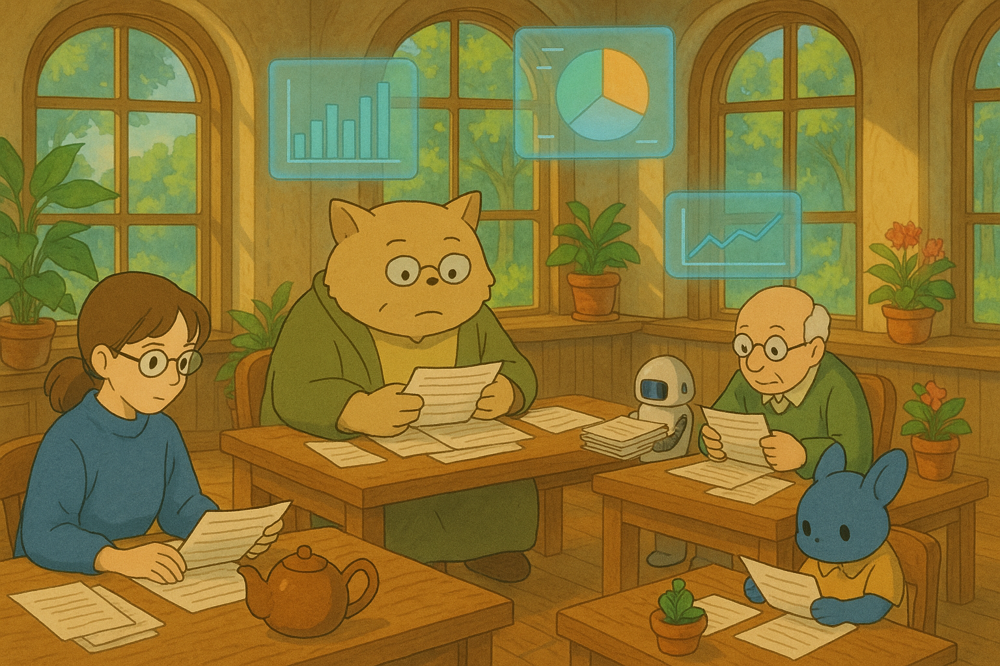

Каждый день три расы программистов — люди, желеобразные блобы с Юпитера и летающие макаронные монстры с Альфа Центавра — получали по 1000 единиц своей валюты на вкусняшки. Кто-то тратил всё на хрустящие снеки, кто-то экономил, довольствуясь крошкой от нано-пирожка. Вечером каждый программист заполнял анкету, указывая точную сумму потраченного:

- в кредитах (для людей)
- желеточках (блобах)
- спагеттикоинах (монстров).


Анкета представляла из собой следующую форму:

| Поле           | Описание                                                                                                     |
| -------------- | ------------------------------------------------------------------------------------------------------------ |
| `id`           | Уникальный идентификатор записи                                                                              |
| `civ`          | Цивилизация программиста (**humans** - люди, **blobs** - блобы с Юпитера, **monsters** - макаронные монстры) |
| `developer_id` | Уникальный идентификатор программиста                                                                        |
| `date`         | Дата заполнения анкеты (В галактическом времяисчислении - от 0 до 364)                                       |
| `spend`        | Потраченная сумма в соответствующей валюте (кредиты/желеточки/спагеттикоины)                                 |


Среди программистов даже существовали даже негласные соревнования: одни старались потратить максимум, чтобы показать роскошь, другие — минимум, чтобы прослыть аскетами.

По всей галактике сновали почтальоны — меховые, железные, или даже с крыльями — собирая сотни тысяч цифр.

Анкеты соединилясь в один большой документ, который мог выглядеть так:

| id  | civ      | developer_id  | date | spend |
| --- | -------- | ------------- | ---- | ----- |
| 2   | humans   | 8678368907900 | 349  | 831   |
| 3   | monsters | 7858304181810 | 53   | 169   |
| 4   | humans   | 3138087482491 | 257  | 651   |
| 5   | blobs    | 6631649894514 | 7    | 20    |

По очень старой привычке такую таблицу хранили в `csv` формате

К сожалению, иногда анкета могла содержать невалидные данные. Это могли быть:

- Испорченная анкета, без данных и без запятых, например:

  `&$3a}qDu!E8V?a7KBn0}`

- Неверно записанная цивилизация
  | id | civ | developer_id | date | spend |
  | --- | -------- | ------------- | ---- | ----- |
  | 2 | unknown_asdasd | 8678368907900 | 349 | 831 |
- Отрицательная сумма траты
  | id | civ | developer_id | date | spend |
  | --- | -------- | ------------- | ---- | ----- |
  | 2 | humans | 8678368907900 | 349 | -100 |

Такие анкеты тоже могли попасть в общую таблицу.

---



В отделе статистики ждали сбора абсолютно всех данных, а потом конвертировали валюты в галактические кредиты, используя специальный курс, который ежедневно обновлялся. Это позволяло составить следующий итог:

- сколько потрачено всего (`total_spend_galactic`)
- сколько записей пришло (`rows_affected`)
- какой день оказался самым скромным (`less_spent_at`)
- какой день — рекордным по тратам (`big_spent_at`)

Отдельно фиксировали сами суммы:

- наименьший расход - `less_spent_value`
- наибольший расход - `big_spent_value`
- средний расход — `average_spend_galactic`

Статистика не только считала, но и ранжировала:

- какая цивилизация потратила больше всех (`big_spent_civ`)
- какая — меньше всех (`less_spent_civ`)

Все строки с невалидным даннымм не учитывались в статистике, но их количество также считалось и отображалось в отдельном поле:

- `ivalid_rows` - количество строк с невалидным данными

Итоговый результат сохраняли в JSON формате и выглядеть он мог примерно так:

```json
{
  "total_spend_galactic": 1402868385.230134,
  "rows_affected": 2862779,
  "less_spent_at": 273,
  "big_spent_at": 248,
  "less_spent_value": 2380854.4619028047,
  "big_spent_value": 5524160.104993988,
  "average_spend_galactic": 490.03726282403704,
  "big_spent_civ": "humans",
  "less_spent_civ": "blobs",
  "ivalid_rows": 0
}
```

Так простое поедание вкусняшек превратилось в сложную, масштабную систему межгалактической аналитики. Был в ней единственный минус - аналитики всегда ждали сбора всех данных, прежде чем начать свою работу. Но пока они справлялись, никто на это не обращал внимания.

---

Со временем число программистов выросло в десятки раз. Каждый из них тоже захотел участвовать в великом опросе вкусняшек — ведь было весело тратить валюту и соревноваться с соседними расами.


Почтальоны едва справлялись: к ним выстраивались километровые очереди из программистов с анкетами в лапках, щупальцах и парящих каплях желе. В отделе статистики царил бумажный апокалипсис — кучи анкет заваливали столы, стулья и даже потолочные вентиляторы. Сотрудники пытались обрабатывать данные, но курсы валют менялись, а галактические кредиты множились быстрее, чем они успевали считать.

Отчёты терялись, спагеттикоины слипались, а один аналитик случайно пересчитал желеточки как проценты.


В это время в углу, молча и глубоко задумавшись, два программиста. Они изучали голографические графики и кипу бумаг.
В их взгляде читалось: пора всё изменить — и, возможно, создать что-то гораздо лучше и быстрее текущей системы обработки.


